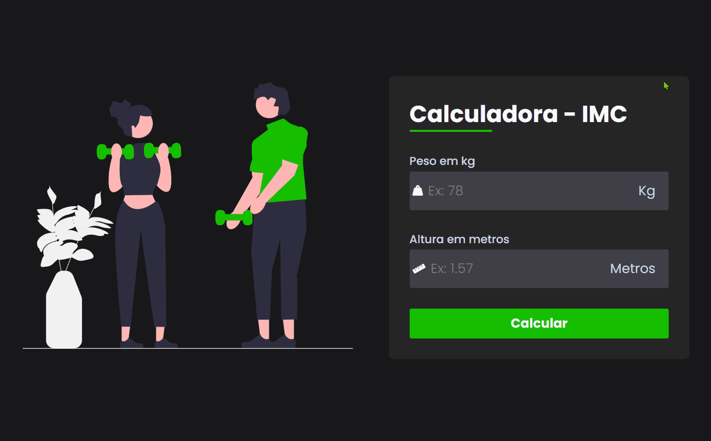

# "Como está sua saúde?"

Com essa simples calculadora você pode verificar se está só "inchado" ou se está "grande".

Calcule seu IMC informando seu peso e altura e fique de olho no resultado! Saúde em primeiro lugar.

 

# "How's your health?"

With this simple calculator you can check if you're just ‘bloated’ or if you're ‘big’.

Calculate your BMI by entering your weight and height and keep an eye on the result! Health first.

You can view the project via the link:  
https://srbaliardo.github.io/imc-calculator

 

 

"  |
 |
 "
